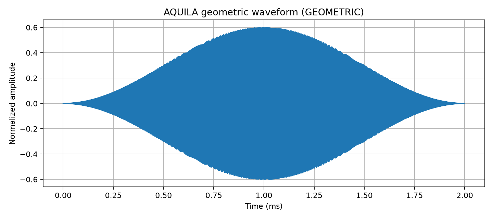
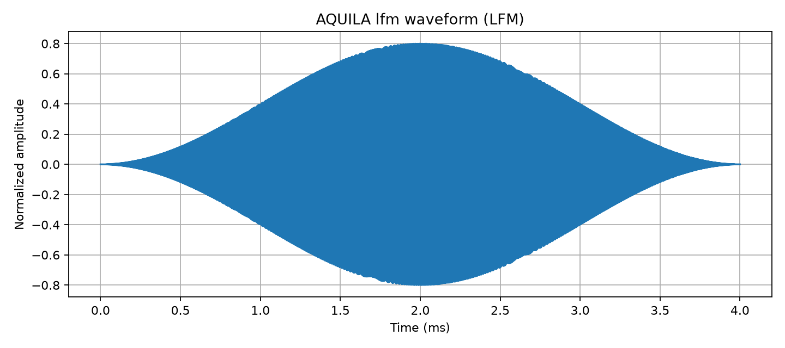
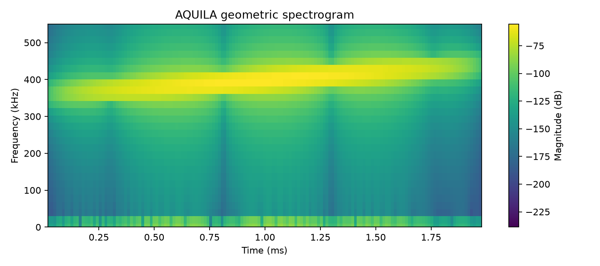
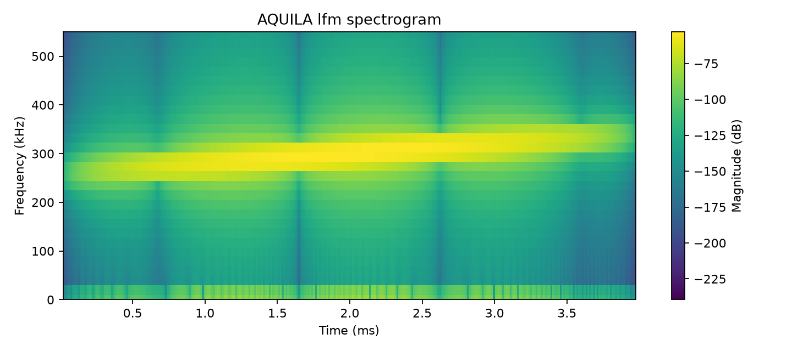

# AQUILA

**AQUILA is a low-power, real-time adaptive Software-Defined Sonar Transmitter Payload for Autonomous Underwater Vehicles (AUVs).**

The system receives or is intended to sense environmental parameters, classifies the operating condition, selects an adaptive sonar transmission profile from a precomputed lookup table (LUT), generates the selected waveform in FPGA RTL, converts samples through a DAC interface, and targets an analog output for measurement and eventual acoustic transmission. Low power and real-time adaptation are design objectives; this repository does not establish physical power consumption or deployed real-time performance.

This repository contains the FPGA/RTL implementation, environmental adaptation logic, waveform-generation system, DAC interface logic, analog-path behavioral models, simulation and validation tools, and test infrastructure that support development of the physical transmitter payload. **Simulation is one engineering verification layer in AQUILA; it is not the product itself.**

## 1. Project Overview

AQUILA addresses the limitation of a sonar transmitter that always uses fixed transmission parameters while underwater conditions change. Its prototype architecture adapts a pulse profile to classified temperature, salinity, turbidity, and AUV-to-seabed range/depth inputs instead of continuously transmitting one fixed waveform.

The current code demonstrates the digital decision and waveform path and includes modeled DAC and analog stages. Physical construction, target-board integration, and acoustic performance are not claimed as complete.

## 2. Problem Being Addressed

Water conditions and operating range can vary during an AUV mission. A fixed center frequency, bandwidth, pulse duration, amplitude, and waveform mode may not be the desired operating point in every condition. AQUILA explores a deterministic, profile-based adaptation approach: classify the inputs, select a precomputed profile, hold it stable for the active ping, and use it to configure the next transmission.

The profile mapping in this repository is a prototype engineering policy. The simulations do not establish that a selected profile is optimal for real propagation, scattering, or imaging conditions.

## 3. AQUILA System Architecture

This is the intended system-level path. The digital processing and interface behavior are represented by repository RTL and models; the analog output and acoustic stages remain targets for physical validation.

```text
ENVIRONMENTAL INPUTS
	|
	v
Temperature / Salinity / Turbidity / AUV-to-seabed Range (Depth)
	|
	v
LOW / MEDIUM / HIGH CLASSIFICATION
	|
	v
8-bit ENVIRONMENTAL STATE ADDRESS
	|
	v
81-STATE PRECOMPUTED LUT
	|
	v
Adaptive Profile (Frequency / Bandwidth / Pulse Duration / Amplitude / Mode)
	|
	v
Ping-Boundary Profile Latch
	|
	v
FPGA Waveform Generation
	|
	v
LFM / Geometric Sweep / Phase-Coded Pulse
	|
	v
Digital Hann Window
	|
	v
DAC Interface / Behavioral DAC Model
	|
	v
Analog Signal Conditioning (behavioral model)
	|
	v
Amplification (behavioral model)
	|
	v
Physical Analog Sonar Transmitter Output (target, not demonstrated here)
	|
	v
Oscilloscope / FFT / Spectrogram Validation
	|
	v
Future acoustic / transducer validation
```

```text
AQUILA PROJECT
├── Adaptive sonar transmitter architecture
├── Environmental adaptation
├── FPGA implementation
├── Waveform generation
├── DAC interface
├── Analog signal-path models
├── Simulation
├── RTL verification
└── Physical validation
```

## 4. Environmental Adaptation

The classifier consumes temperature, salinity, turbidity, and `range` (named `range_m` in the Python environment model). Range represents the prototype AUV-to-seabed range/depth input. The repository has digital input ports and classification logic; it does not demonstrate physical sensor acquisition or installed sensors.

Current prototype thresholds in `python_model/config.py` and `rtl/sensor_classifier.sv` are:

| Input | LOW | MEDIUM | HIGH |
|---|---|---|---|
| Temperature | below 20 C | 20-30 C, inclusive | above 30 C |
| Salinity | below 300 | 300-600, inclusive | above 600 |
| Turbidity | below 20 | 20-100, inclusive | above 100 |
| Range/depth | below 1 m | 1-3 m, inclusive | above 3 m |

Each state is represented as 2'b00, 2'b01, or 2'b10 for LOW, MEDIUM, or HIGH; 2'b11 is unused. These are prototype code thresholds, not sensor calibration claims.

## 5. Adaptive LUT

The state encoder concatenates temperature, salinity, turbidity, and range states, in that order, into an 8-bit LUT address. Four 2-bit values provide 256 possible bit patterns, of which 3^4 = 81 are valid classified environmental combinations.

The 81-entry LUT selects center frequency, bandwidth, pulse duration, amplitude, and waveform mode. `python_model/adaptive_lut.py` builds and validates the reference mapping; `python_model/generate_adaptive_lut_sv.py` generates the corresponding SystemVerilog LUT. The current mapping uses a range-state base profile and adjusts frequency/bandwidth for the other states before validating its bounds. This is a deterministic prototype policy, not a propagation-trained or underwater-optimized LUT.

## 6. FPGA Waveform Generation

The RTL is intended to provide deterministic, hardware-timed environmental classification, LUT lookup, profile validation, waveform selection, sample generation, and DAC interface timing. The active profile is held by `ping_profile_latch` and only replaced after the current pulse completes, preventing profile changes in the middle of a ping.

The current system test uses a 50 MHz clock and a 5 MHz sample-enable target. The repository includes sample timing, FIFO/formatter, waveform, and serial-stream logic. It does not contain a conventional MCU-style DMA controller: streaming is represented by FPGA sample timing, FIFO buffering, and hardware serial interface engines. RTL presence and simulation do not establish FPGA timing closure or physical board operation.

## 7. Waveform Modes

The current architecture implements three selectable modes:

- **LFM chirp:** frequency changes linearly over the pulse.
- **Geometric frequency sweep:** the geometric engine sweeps between start and end frequencies.
- **Phase-coded pulse:** the phase-coded engine applies phase changes to a carrier.

All three modes appear in the Python reference model and SystemVerilog waveform path. Profile values are selected by the LUT and checked by the prototype safety logic.

## 8. DAC and Analog Signal Path

The RTL contains AD3541R-named single-lane SPI and dual-data-line stream interface logic, plus a sample formatter. Python contains a behavioral 16-bit DAC quantizer and analog-path model. The model applies a fourth-order low-pass filter, modeled output-driver stages, and voltage/current/power calculations into a 50-ohm electrical load.

The configured model assumes a 2.5 V DAC full-scale, a 700 kHz filter cutoff with a 226 ohm / 1 nF RC concept, and unity gains for modeled OPA2835 and OPA2684 stages. The component names and values are references/assumptions in source code, not proof that a physical board uses these parts or matches these responses. No physical analog measurements are established by this repository.

`python_model/power_budget.py` also lists FPGA, environmental sensors, MCP3208, a level translator, AD3541R, OPA2835, and OPA2684 with configurable supply/current estimates. These entries document the budget model only; they are not a verified bill of materials or proof that the components are physically assembled.

## 9. Role of Simulation

The Python simulation is not the sonar payload. It is an engineering/development layer used to evaluate the adaptive transmission architecture before physical integration. In this repository it is used to:

1. Model environmental inputs.
2. Test LOW/MEDIUM/HIGH classification.
3. Verify the 8-bit state encoding.
4. Generate and validate the 81-state adaptive LUT.
5. Generate reference waveform data.
6. Model LFM, geometric, and phase-coded waveforms.
7. Apply digital windowing.
8. Check prototype sweep-frequency bounds.
9. Model DAC quantization and output behavior.
10. Model the analog signal-conditioning path.
11. Analyze output waveforms.
12. Perform FFT and spectrogram analysis.
13. Estimate voltage and power into a defined electrical load.
14. Perform system-level validation before physical hardware testing.

Simulation is an engineering verification layer between algorithm design and physical implementation. It allows the adaptive LUT, waveform engines, timing behavior, DAC-interface assumptions, and analog signal path to be evaluated before hardware bring-up. It reduces development risk and checks mathematical, digital, and behavioral models; it does not replace physical validation.

```text
Algorithm verification
	|
	v
RTL verification
	|
	v
Waveform/reference validation
	|
	v
Analog behavioral validation
	|
	v
Hardware implementation and bring-up
	|
	v
Physical oscilloscope / FFT validation
	|
	v
Future acoustic / transducer validation
```

### Current simulation configuration

The current Python system-level simulation uses a 5 MSPS target sample rate, 81 LUT profiles, LFM/geometric/phase-coded modes, Hann windowing, behavioral DAC quantization, a fourth-order low-pass analog model, output-driver behavioral stages, a 50-ohm electrical load, and FFT/spectrogram analysis. The sample-rate target corresponds to a 50 MHz clock divided into 10-cycle sample enables in the RTL model.

The model configuration includes a 16-bit DAC quantizer with a 2.5 V full-scale assumption, a fourth-order Butterworth low-pass filter set to 700 kHz (with a 226 ohm / 1 nF RC concept), and unity-gain OPA2835/OPA2684 behavioral stages. The 50-ohm load, component current values, and power calculations are engineering assumptions. They are not experimentally measured voltage, power, component performance, or underwater results.

The problem statement uses 100 kHz and 500 kHz as examples of the low/high-frequency sonar trade-off. Separately, the current prototype uses the 100-500 kHz region as its PS-facing electrical demonstration/profile-validation region and safety bounds. This is not a claim that the project specification mandates continuous 100-500 kHz operation, nor evidence of acoustic performance across the band.

Keep the categories distinct:

| Category | Meaning in this project |
|---|---|
| Problem statement and project objective | Frequency examples describe a trade-off; low-power, real-time adaptive AUV payload operation is the design objective. Neither is proof of measured physical performance. |
| RTL behavior | Digital classification, LUT/profile logic, waveform/sample timing, checks, and interface logic exercised by testbenches. |
| Hardware references / estimates | AD3541R-named RTL and the component list in `power_budget.py`; these do not establish a verified bill of materials or physical device operation. |
| Simulation assumptions | DAC range/resolution, filter, output-driver stages, load, and estimated component currents. |
| Physical evidence | No oscilloscope, hydrophone, tank, or underwater measurements are established by these software simulations. |

### Simulation requirements and setup

#### Python model

- Python 3 with `pip` (validated with Python 3.14.7).
- NumPy
- SciPy
- Matplotlib
- pandas (used by capture-analysis scripts)

#### RTL simulation

- Icarus Verilog with SystemVerilog support (`iverilog` and `vvp`; validated with Icarus Verilog 12.0).
- A terminal with the repository as the working directory.

On Windows, install Python from [python.org](https://www.python.org/downloads/) or the Microsoft Store, and install Icarus Verilog using a Windows build/package manager. Ensure `python`, `iverilog`, and `vvp` are available on `PATH`. On Linux, install Python and Icarus Verilog from the distribution package manager. On macOS, install them with Homebrew.

#### Set Up the Python Environment

Run these commands from the repository root.

##### Windows PowerShell

```powershell
python -m venv .venv
.\.venv\Scripts\Activate.ps1
python -m pip install --upgrade pip
python -m pip install numpy scipy matplotlib pandas
```

If PowerShell blocks activation, use the environment's executable directly:

```powershell
.\.venv\Scripts\python.exe -m pip install numpy scipy matplotlib pandas
```

##### Linux or macOS

```bash
python3 -m venv .venv
source .venv/bin/activate
python -m pip install --upgrade pip
python -m pip install numpy scipy matplotlib pandas
```

#### Run the Python System Validation

From the repository root, with the environment activated:

```bash
python python_model/system_simulation.py
```

The script validates the classifier and state encoding, all 81 adaptive LUT profiles, frequency limits, 5 MSPS sample-enable timing, all three waveform modes, Hann windowing, the behavioral DAC and analog models, FFT and spectrogram generation, ping-boundary profile changes, and estimated power. A successful run ends with `AQUILA VALIDATION COMPLETE` and prints `PASS` for each check.

##### Expected Python output

The exact numeric values below are from a validated run. Paths, package versions, and plot metadata can differ by machine.

```text
==========================================
			AQUILA SYSTEM VALIDATION
==========================================
Environment model              PASS
Demo address                   : 0x55 (1111)
81-state LUT                   PASS
LUT summary                    : 81/81 valid, modes={'GEOMETRIC': 27, 'LFM': 27, 'PHASE_CODED': 27}
Frequency range                : 137580 to 468400 Hz
Pulse duration range           : 2000 to 8000 us
Amplitude range                : 600 to 1000
100-500 kHz safety             PASS
5 MSPS sample timing           PASS
Sample timing                  : 10 FPGA cycles, 5000000 Hz
Geometric                      PASS
	geometric: address=0x50, Fc=400000 Hz, sweep=360000-440000 Hz, N=10000, Vpp=1.1954 V, Vrms=0.2588 V, P=0.001339 W
Lfm                            PASS
	lfm: address=0x51, Fc=300000 Hz, sweep=260000-340000 Hz, N=20000, Vpp=1.5988 V, Vrms=0.3463 V, P=0.002398 W
Phase_Coded                    PASS
	phase: address=0x52, Fc=180000 Hz, sweep=150000-210000 Hz, N=40000, Vpp=2.0176 V, Vrms=0.4330 V, P=0.003750 W
Hann window                    PASS
Ping-boundary adaptation       PASS
DAC model                      PASS
Analog filter                  PASS
Output amplifier model        PASS
FFT                           PASS
Spectrogram                   PASS
DAC interface audit            PASS
Single-lane SPI max rate      : 416667 samples/s (NOT 5 MSPS capable)
Dual-SPI/DDR stream estimate  : 520833 samples/s (below 5 MSPS target)
Power calculation              PASS
Electronics power estimate    : 0.8331 W
50-ohm load power estimate    : 0.010000 W

==========================================
			AQUILA VALIDATION COMPLETE
==========================================
Results directory              : python_model/results
Demo environment               : Environment(temperature=28.0, salinity=450.0, turbidity=35.0, range_m=2.5)
```

The run writes summary data and plots under `python_model/results/`, including:

- `system_summary.csv` with the three demo waveform cases and modeled output metrics.
- `analog_response.csv` with the modeled analog-filter response.
- Time-domain, FFT, and spectrogram plots for geometric and LFM waveforms, and time-domain and FFT plots for the phase-coded waveform.

##### Reference plots

These plots are generated by the Python system validation. Select an image to open its full-size version.

| Geometric sweep | LFM chirp | Phase-coded waveform |
|---|---|---|
| [](python_model/results/geometric_time.png) | [](python_model/results/lfm_time.png) | [](python_model/results/phase_time.png) |

The spectrograms show how frequency changes over time for the swept waveforms:

| Geometric sweep spectrogram | LFM chirp spectrogram |
|---|---|
| [](python_model/results/geometric_spectrogram.png) | [](python_model/results/lfm_spectrogram.png) |

Useful related scripts include `python_model/adaptive_lut.py` for building and validating the adaptive LUT, `python_model/generate_adaptive_lut_sv.py` for generating the corresponding SystemVerilog LUT, and `python_model/analyze_lfm_capture.py` for analyzing an LFM CSV capture.

## 10. RTL Verification

The main system-level testbench is `tb_aquila_system_5msps`. From the repository root, compile the RTL sources and testbenches, selecting that testbench as the simulation top.

### Windows PowerShell

```powershell
New-Item -ItemType Directory -Force .\build | Out-Null
$rtl = Get-ChildItem .\rtl -Filter *.sv | ForEach-Object { $_.FullName }
iverilog -g2012 -s tb_aquila_system_5msps -o .\build\aquila_5msps.vvp $rtl
if ($LASTEXITCODE -eq 0) { vvp .\build\aquila_5msps.vvp }
```

### Linux or macOS

```bash
mkdir -p build
iverilog -g2012 -s tb_aquila_system_5msps -o build/aquila_5msps.vvp rtl/*.sv
vvp build/aquila_5msps.vvp
```

The testbench checks initial and ping-boundary profiles, profile limits, and sample-enable timing. A successful run prints `PASS: Aquila 5-MSPS system-level RTL simulation`. It also writes `aquila_5msps.vcd` in the current working directory; open that file in a waveform viewer such as GTKWave to inspect signal timing.

### Expected RTL output

Icarus Verilog 12.0 emits the following non-fatal warnings before the testbench results. The source paths shown here are relative to the repository root.

```text
rtl/digital_window.sv:89: sorry: constant selects in always_* processes are not currently supported (all bits will be included).
rtl/digital_window.sv:89: sorry: constant selects in always_* processes are not currently supported (all bits will be included).
rtl/digital_window.sv:89: sorry: constant selects in always_* processes are not currently supported (all bits will be included).
rtl/digital_window.sv:89: sorry: constant selects in always_* processes are not currently supported (all bits will be included).
rtl/phase_coded_waveform_engine.sv:48: sorry: constant selects in always_* processes are not currently supported (all bits will be included).
VCD info: dumpfile aquila_5msps.vcd opened for output.
INITIAL: addr=aa mode=2 Fc=167580 BW=48000 Tp_us=8000 Amp=1000 valid=1
BOUNDARY: addr=00 requested_mode=0 active_mode=0 active_Fc=428400
TIMING: sample_enable interval=200 ns frequency=5 MHz events=5380
PASS: Aquila 5-MSPS system-level RTL simulation
rtl/tb_aquila_system_5msps.sv:134: $finish called at 1076210000 (1ps)
```

Icarus may print `sorry: constant selects in always_* processes are not currently supported` warnings for some RTL constructs. With the validated Icarus version, these warnings are non-fatal and the testbench completes successfully.

For a smaller sample-rate-generator-only test, compile `rtl/sample_rate_generator.sv` and `rtl/tb_final_5msps.sv`, selecting `tb_final_5msps` as the top:

```bash
iverilog -g2012 -s tb_final_5msps -o build/sample_rate.vvp rtl/sample_rate_generator.sv rtl/tb_final_5msps.sv
vvp build/sample_rate.vvp
```

Other testbenches in `rtl/` cover the controller, LUT, waveform engines, windowing, safety checks, streaming, SPI, and DAC paths. To run a different testbench, change the `-s` top-module name to that bench's module name; include the RTL files it instantiates.

## 11. Physical Hardware Validation

RTL modules, testbenches, interface logic, behavioral models, captures, and analysis tools are present in the repository. The audit report identifies sensor wiring, enclosure, physical DAC analog output, oscilloscope measurements, and underwater propagation as outstanding hardware-validation work. The repository does not establish that a complete payload, analog front end, amplifier chain, acoustic transducer, or AUV integration has been built and validated.

The current interface throughput estimates are below the 5 MSPS sample-generation target: the single-lane 24-bit SPI path at 10 MHz is approximately 416.7 kSPS; the dual-SPI/DDR-style stream engine at approximately 8.333 MHz and 16 SCLK cycles per sample is approximately 520.8 kSPS. The 5 MSPS test verifies sample-enable timing and digital waveform behavior, not sustained DAC delivery at 5 MSPS. Physical interface timing and device operation must be measured on target hardware.

## 12. Current Simulation Scope and Limitations

The Python signal chain is an electrical/behavioral model. It is **not an underwater propagation simulator** and does not prove:

- Underwater acoustic propagation or transmission range.
- Actual sonar imaging or detection performance.
- Scattering behavior in real water.
- Acoustic efficiency of a transducer.
- Hydrophone-measured acoustic output.

Those require later physical, tank/water, and transducer validation. Similarly, the power budget is an estimate based on configured component current values, not measured payload consumption. The 50-ohm load is an electrical calculation case, not an acoustic transducer model. Filter and driver stages are behavioral assumptions, not measured analog front-end responses. FFT and spectrograms characterize generated/modelled electrical waveforms; they are not sonar images or evidence of underwater performance.

The 100-500 kHz values are current prototype electrical profile bounds and example demonstration frequencies. They are not a requirement for continuous operation imposed by the problem statement.

## 13. Repository Structure

| Path | Actual contents |
|---|---|
| `python_model/` | Python environment/classifier/state encoder, LUT generation and validation, DDS/waveform/windowing, analog/DAC models, power estimate, capture analysis, and system simulation. |
| `python_model/results/` | Generated summary/response CSVs and time-domain, FFT, and spectrogram plots. |
| `rtl/` | SystemVerilog classifier, encoder, LUT, safety/profile latch, waveform engines, sample timing, FIFO/formatter, DAC interface/stream engines, and testbenches. Also includes capture CSVs, waveform-analysis Python scripts, plots, and simulation artifacts. |
| `AQUILA_AUDIT_REPORT.md` | Audit findings, active-path notes, throughput estimates, and outstanding physical validation. |
| `aquila_5msps.vcd` | Top-level RTL simulation waveform dump. |
| `aquila_lfm_spectrogram.png` | Project-level LFM reference plot. |
| `.gitignore` | Ignores Python caches and common generated RTL simulation outputs for future Git adds. |
| `README.md` | Project architecture, model scope, setup, and verification instructions. |

CSV captures and PNG plots are reference outputs and input data. Committed VCDs and compiled simulator executables are generated artifacts, not source code.

## 14. Development Status / Roadmap

| Area | Status represented by this repository |
|---|---|
| Environmental classifier, 8-bit encoding, and 81-profile LUT | Python and RTL source present; system Python validation checks all 81 profiles. Thresholds and LUT policy remain prototype assumptions. |
| Three waveform modes, digital window, safety checks, and ping-boundary latch | RTL and Python models present; exercised by simulation/test infrastructure. |
| DAC interface and sample-stream logic | AD3541R-named single-lane and dual-data-line RTL plus testbenches are present. Current audited interface estimates do not reach 5 MSPS. |
| DAC/analog/output-driver behavior and power | Behavioral models and estimates only; physical component operation and values are not confirmed. |
| Physical AUV payload and analog output | Not established as built or validated here; target-board integration, sensor interfaces, analog measurements, and packaging remain bring-up work. |
| Acoustic/transducer and underwater performance | Future validation; requires physical transducer, tank/water testing, and suitable acoustic measurements. |

Next engineering milestones are target-board integration and timing closure, environmental-input integration, measurement of sustained DAC throughput, oscilloscope characterization of the real analog path, and later transducer/tank validation. Low-power performance should only be claimed after measuring the implemented payload under defined conditions.

Re-running simulations may update files in `python_model/results/` or create new waveform dumps and compiled RTL outputs locally.
