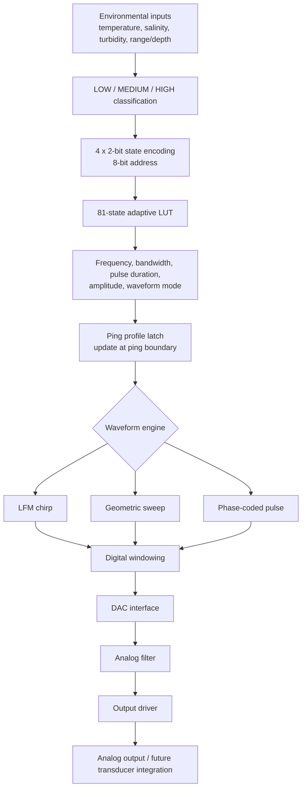
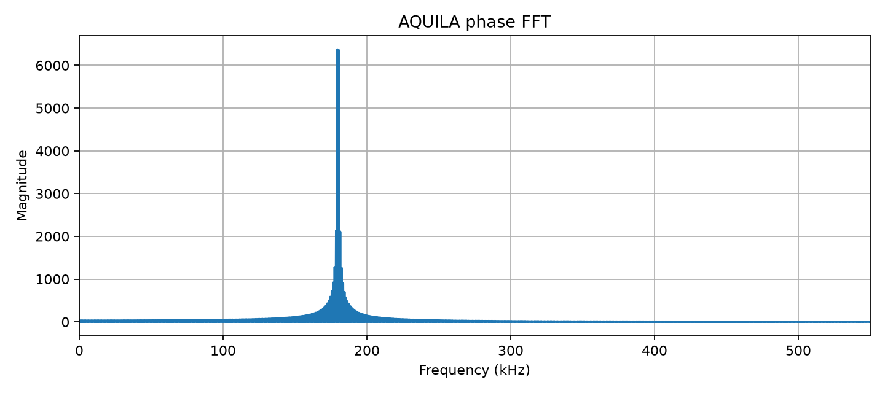
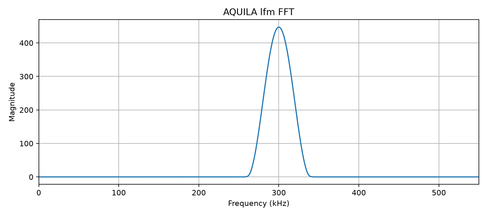
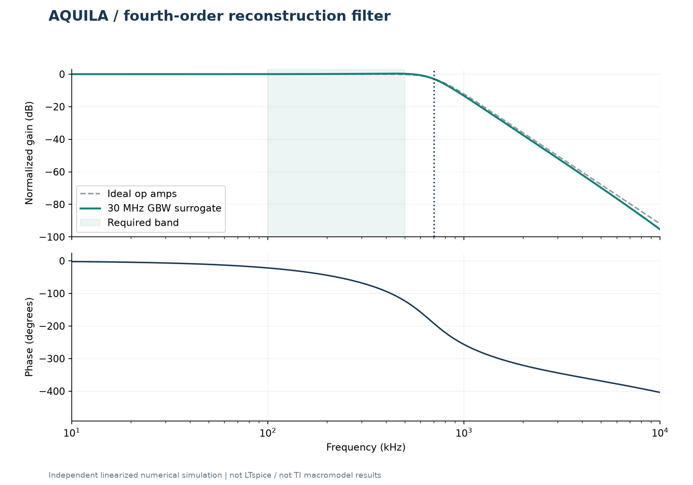
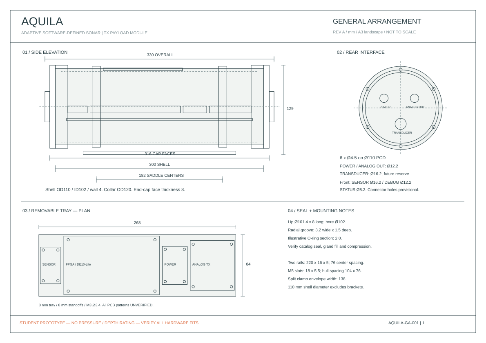

# FPGA-Based Environment-Adaptive Sonar Transmitter for AUVs

**AQUILA is the repository and prototype identifier for an engineering development project exploring environment-adaptive sonar transmission on an FPGA.** It contains Python reference models, SystemVerilog RTL and testbenches, an analog transmitter design, a KiCad PCB layout, and a CadQuery-generated mechanical payload model. It is not a completed or field-qualified sonar product.

The repository mixes runnable models and design artifacts. Physical performance, underwater operation, and hardware integration remain to be demonstrated.

**Prototype capabilities:** 81-state table-based profile selection, three waveform modes, ping-boundary profile control, Python/RTL simulation, and companion analog, PCB, and mechanical design artifacts.

## Quick Start

1. Clone and install the Python dependencies:

   ```powershell
   git clone https://github.com/tharun-28102006/AQUILA.git
   cd AQUILA
   python -m venv .venv
   .\.venv\Scripts\Activate.ps1
   python -m pip install --upgrade pip
   python -m pip install -r requirements.txt
   ```

   On Linux/macOS, use `python3 -m venv .venv` and `source .venv/bin/activate`.
2. Run `python python_model/system_simulation.py`. Plots and summary CSVs are written to `python_model/results/`.
3. Install Icarus Verilog and run the [RTL system test](#running-the-systemverilog-rtl-simulation). It writes `build/aquila_5msps.vcd`.
4. Browse the [simulation results](#simulation-results), [KiCad board](Aquila_pcb/AQUILA_TX_PCB_FIXED.kicad_pcb), [LTspice design](AQUILA_LTSPICE/), and [mechanical drawing](aquila-freecad/AQUILA_drawing.svg).

## System Architecture



This is the intended signal path represented across models and designs. Physical sensor acquisition, sustained DAC streaming, analog measurements, and transducer integration are not established by these artifacts.

### Simulation Preview


This checked-in plot is a 4 ms, 300 kHz-center LFM example from the Python model, not a measured hardware waveform. Detailed [waveforms, FFTs, spectrograms, and provenance](#simulation-results) follow below.

## Project Overview

AQUILA explores selecting a sonar pulse profile from four environmental inputs rather than using one fixed profile. Temperature, salinity, turbidity, and AUV-to-seabed range/depth are classified into three discrete states. The selected profile is held stable during a ping and may be replaced at the next ping boundary.

### Problem and Proposed Solution

Water conditions and operating range can change during an AUV mission. The prototype investigates deterministic profile selection and FPGA waveform generation as a reconfigurable transmitter architecture. It encodes classified inputs, looks up a precomputed profile, validates it, and latches it for the ping. The lookup avoids computing a new profile through complex runtime propagation arithmetic. Thresholds and profile policy are assumptions, not experimentally calibrated environmental or propagation data.

## How the System Works

1. Python or RTL receives numeric environmental inputs. Physical sensors and acquisition electronics are not demonstrated here.
2. The classifier maps each input to LOW, MEDIUM, or HIGH.
3. The state encoder concatenates four 2-bit states into an 8-bit LUT address.
4. The LUT supplies center frequency, bandwidth, pulse duration, amplitude, and waveform mode.
5. A safety validator checks the requested profile. The ping-profile latch captures the first valid profile and updates it only after `ping_done`.
6. The selected waveform engine generates samples. The digital path includes windowing and a DAC sample interface.
7. Python behavioral analog models and a separate LTspice design represent the filter/output chain. Physical output and acoustic stages require future validation.

### Environmental-State Classification

These are prototype thresholds, not sensor calibration specifications. Salinity and turbidity units are not defined in the model documentation.

| Input | LOW | MEDIUM | HIGH |
|---|---|---|---|
| Temperature | below 20 C | 20-30 C, inclusive | above 30 C |
| Salinity | below 300 | 300-600, inclusive | above 600 |
| Turbidity | below 20 | 20-100, inclusive | above 100 |
| Range/depth | below 1 m | 1-3 m, inclusive | above 3 m |

Python code: [`classifier.py`](python_model/classifier.py), [`environment.py`](python_model/environment.py), [`config.py`](python_model/config.py). RTL logic: [`sensor_classifier.sv`](rtl/sensor_classifier.sv). LOW, MEDIUM, and HIGH encode as `00`, `01`, and `10`; `11` is unused.

### 81-State Adaptive LUT

There are four inputs, each with three valid classes, so there are 3 x 3 x 3 x 3 = 81 valid combinations. Each class uses 2 bits; temperature, salinity, turbidity, and range/depth are concatenated in that order to form the 8-bit address. The other address patterns are not valid classifier outputs.

[`python_model/adaptive_lut.py`](python_model/adaptive_lut.py) builds and checks the reference table. RTL/Python generated tables are [`rtl/adaptive_lut.sv`](rtl/adaptive_lut.sv) and [`python_model/adaptive_lut.sv`](python_model/adaptive_lut.sv); reference data is [`python_model/adaptive_lut_reference.csv`](python_model/adaptive_lut_reference.csv). The current policy starts from a range-state profile, adjusts frequency for temperature/salinity and bandwidth for turbidity, then checks configured limits. It is a deterministic prototype policy, not a propagation-trained or experimentally calibrated LUT.

The main Python simulation selects these demonstration profiles:

| Case | Address | Center frequency | Sweep | Duration | Amplitude control | Mode |
|---|---:|---:|---:|---:|---:|---|
| Geometric | `0x50` | 400 kHz | 360-440 kHz | 2 ms | 600/1000 | Geometric |
| LFM | `0x51` | 300 kHz | 260-340 kHz | 4 ms | 800/1000 | LFM |
| Phase-coded | `0x52` | 180 kHz | 150-210 kHz | 8 ms | 1000/1000 | Phase-coded |

Amplitude is a model control on a 0-1000 scale, not a physical DAC voltage.

### Waveform Generation

The active Python system waveform builder is `generate_waveform()` in [`python_model/system_simulation.py`](python_model/system_simulation.py). The standalone LFM helper is [`python_model/waveform_lfm.py`](python_model/waveform_lfm.py). RTL mode dispatch is in [`rtl/aquila_waveform_top.sv`](rtl/aquila_waveform_top.sv) and [`rtl/mode_selector.sv`](rtl/mode_selector.sv).

#### LFM Chirp

The Python system model increments instantaneous frequency from the profile sweep start toward its end over the pulse, then applies a Hann window for analysis. RTL uses [`rtl/lfm_waveform_generator.sv`](rtl/lfm_waveform_generator.sv), [`rtl/lfm_dds.sv`](rtl/lfm_dds.sv), and the sine LUT. These are generated electrical samples, not acoustic transmission.

#### Geometric Frequency Sweep

The Python system model uses geometrically spaced instantaneous frequencies (`numpy.geomspace`). RTL uses [`rtl/geometric_waveform_engine.sv`](rtl/geometric_waveform_engine.sv), selected through the mode selector. Its frequency progression is not linear like an LFM chirp.

#### Phase-Coded Pulse

The Python model applies discrete phase reversals to a carrier. RTL uses [`rtl/phase_coded_waveform_engine.sv`](rtl/phase_coded_waveform_engine.sv) and [`rtl/phase_code_lut.sv`](rtl/phase_code_lut.sv). The separate LTspice stimulus documents its own seven-chip illustrative sequence; do not assume the implementations are identical or that they implement a named Barker code.

### Ping-Boundary Parameter Control

[`rtl/ping_profile_latch.sv`](rtl/ping_profile_latch.sv) captures the first valid profile, then holds frequency, bandwidth, duration, amplitude, and mode until `ping_done`. The system test changes requested environmental inputs during a ping and checks that the active mode changes at the boundary. Python includes a corresponding assertion in `validate_ping_boundary()`. Neither test establishes physical sensor-to-DAC operation.

## Digital Simulation

The main Python entry point is [`python_model/system_simulation.py`](python_model/system_simulation.py). It checks the demonstration environment/address, all 81 LUT profiles, frequency limits, waveform/window generation, behavioral DAC/filter/output calculations, FFT/spectrogram analysis, ping-boundary behavior, and estimated DAC-interface rates.

The main SystemVerilog integration test is [`rtl/tb_aquila_system_5msps.sv`](rtl/tb_aquila_system_5msps.sv), with top-level system wiring in [`rtl/aquila_system_top.sv`](rtl/aquila_system_top.sv). Other benches cover LUT, classifier, waveform, timing, windowing, SPI, and stream-engine blocks. Some captures are standalone or legacy-rate experiments; the 5 MSPS system test is the documented current integration bench.

## Simulation Results

The following checked-in PNGs are Python reference/system-model outputs unless otherwise stated. They are generated waveforms and numerical analyses, not oscilloscope, hydrophone, or native LTspice measurements. Per-case metrics are in [`python_model/results/system_summary.csv`](python_model/results/system_summary.csv).

### LFM Waveform


This is the windowed 4 ms LFM example at LUT address `0x51` (300 kHz center, 80 kHz bandwidth) in the 5 MSPS Python model. It shows the modeled pulse envelope and sample waveform, not a measured DAC output. See [CSV metrics](python_model/results/system_summary.csv) and [generator](python_model/system_simulation.py).

### Geometric Sweep

| Time-domain output | Time-frequency view |
|---|---|
|  |  |

This is the 2 ms, 360-440 kHz example at address `0x50`. The spectrogram shows the modeled frequency progression during the pulse.

### Phase-Coded Pulse

| Time-domain output | FFT |
|---|---|
|  |  |

This is the 8 ms phase-coded example at address `0x52`, with a 180 kHz carrier profile and 60 kHz profile bandwidth. The FFT is computed from generated, windowed samples, not measured acoustic output.

### LFM Spectrum and Spectrogram

| FFT | Spectrogram |
|---|---|
|  |  |

The FFT shows frequency-domain content from the modeled pulse; the spectrogram shows frequency change over time. Both are regenerated by the Python system simulation.

### LUT Selection and Ping Update

The profile table above comes from the checked-in [`system_summary.csv`](python_model/results/system_summary.csv), which records each demonstration case's states, address, sweep, duration, mode, and modeled output metrics. The [5 MSPS RTL VCD](aquila_5msps.vcd) and [testbench](rtl/tb_aquila_system_5msps.sv) expose `lut_address`, `requested_fc`, `requested_mode`, `active_fc`, `active_mode`, `active_valid`, `profile_valid`, `ping_done`, `sample_enable`, `waveform_sample`, and `dac_sample`. The testbench reports initial/boundary profiles and asserts that active mode does not change before `ping_done`; it does not create a dedicated profile-transition plot.

### Analog Numerical Results



This response plot comes from the independent Python/SciPy analysis, not a native LTspice run. See its [validation summary](AQUILA_LTSPICE/results/validation_summary.json) and [CSV data](AQUILA_LTSPICE/results/ac_response/filter_response.csv) for provenance and values.

Other checked-in CSV captures, VCDs, FFTs, and spectrograms are under [`rtl/`](rtl/) and [`python_model/results/`](python_model/results/). `rtl/` includes standalone and legacy-rate artifacts; do not assume every capture came from the main system test.

## Analog Signal Chain

The repository contains two different analog representations:

- [`python_model/analog_validation.py`](python_model/analog_validation.py) implements a behavioral DAC quantizer, filter, and output/load calculations. Model values and power results are assumptions/estimates, not physical measurements.
- [`AQUILA_LTSPICE/`](AQUILA_LTSPICE/) contains schematics/models for a DAC equivalent, OPA2835 buffer, two Sallen-Key filter sections, OPA2684 current-feedback output-driver equivalent, and 50-ohm load. See its README and engineering report for model provenance and limitations.

The PCB design file places an AD3541R footprint, level translators, OPA2835 buffer/filter stages, OPA2684 driver, regulator, GPIO header, external-power terminal, SMA output, and test points. These related designs are not proof of an assembled electrical implementation.

## LTspice Design

Open [`AQUILA_LTSPICE/AQUILA_TX_ANALOG.asc`](AQUILA_LTSPICE/AQUILA_TX_ANALOG.asc) for the main schematic or [`AQUILA_LTSPICE/AQUILA_FILTER_DETAIL.asc`](AQUILA_LTSPICE/AQUILA_FILTER_DETAIL.asc) for the standalone filter. The equivalent main deck is [`AQUILA_LTSPICE/AQUILA_TX_ANALOG.cir`](AQUILA_LTSPICE/AQUILA_TX_ANALOG.cir). Keep local symbols/includes/models together. Full controls and test benches are in [`AQUILA_LTSPICE/README_AQUILA_LTSPICE.md`](AQUILA_LTSPICE/README_AQUILA_LTSPICE.md).

### Native LTspice Status

Native LTspice and alternate SPICE execution were **not performed** for the checked-in numerical results. The plots and CSVs are from an independent Python/SciPy linearized numerical method; the script does not run the SPICE decks or TI macromodel. Native schematic parsing, convergence, and vendor-model compatibility remain unverified. Do not cite these artifacts as native LTspice measurements.

### Running the Numerical Analog Validation

This runs the Python/SciPy validator, not LTspice. From the repository root:

```powershell
python -m pip install -r .\AQUILA_LTSPICE\scripts\requirements.txt
python .\AQUILA_LTSPICE\scripts\validate_numerically.py
```

It writes plots, CSVs, and JSON under `AQUILA_LTSPICE/results/`. [`AQUILA_LTSPICE/scripts/requirements.txt`](AQUILA_LTSPICE/scripts/requirements.txt) pins this tool's dependencies. [`build_project.py`](AQUILA_LTSPICE/scripts/build_project.py) regenerates design files from a manifest and can overwrite manual edits. To inspect the design, install LTspice separately and open the `.asc` file with its sibling symbols, includes, and models in place.

## PCB Design

The board source is [`Aquila_pcb/AQUILA_TX_PCB_FIXED.kicad_pcb`](Aquila_pcb/AQUILA_TX_PCB_FIXED.kicad_pcb), a KiCad 10-format board. There is no matching `.kicad_sch`, BOM, exported fabrication package, PCB render, or included DRC report. Board dimensions are not documented separately in the reports.

The placed design identifies an AD3541R DAC footprint, SN74AXC4T774 level translators, OPA2835 buffer/filter stages, OPA2684 output driver, AP2112K 1.8 V regulator, DE10-Lite GPIO header, external-power terminal, SMA output, and labeled test points/nets. The apparent signal path from the component/net labels is DE10-Lite GPIO header -> level translators -> DAC -> OPA2835 buffer -> two filter sections -> OPA2684 output driver -> SMA/output. This is an interpretation of the board file, not a verified signal-chain test; there is no matching schematic. These are design-file details, not evidence of DRC clearance, fabrication, assembly, or testing. Verify schematic correspondence, footprints, routing, clearances, and ratings before manufacturing. No KiCad CLI/rendering tool was available, so no board image or DRC result is claimed here.

## Mechanical CAD / Payload



The mechanical package describes a transmitter enclosure and payload layout, not a receiver/hydrophone assembly. Its nominal envelope is approximately 330 mm long x 138 mm wide x 129 mm high; the shell is 300 mm long, 110 mm outside diameter, and 102 mm inside diameter. The drawing is a general arrangement, not a released fabrication drawing.

- [Assembled named-part STEP](aquila-freecad/AQUILA_assembly.step)
- [Exploded STEP presentation model](aquila-freecad/AQUILA_exploded.step); exploded positions are not assembly positions
- [Individual STEP and STL parts](aquila-freecad/parts/)
- [Printable-parts ZIP](aquila-freecad/AQUILA_printable_parts.zip), containing 11 custom printable parts
- [Parametric CadQuery source](aquila-freecad/source/aquila.py)
- [Build notes](aquila-freecad/BUILD_NOTES.md) and [validation metadata](aquila-freecad/validation.json)

No native FreeCAD `.FCStd` file is included; the editable master is the CadQuery Python source. Recorded CAD checks cover B-rep validity and selected nominal fit/STEP round trips, not comprehensive tolerance, pressure, seal, thermal, fatigue, or certification analyses. The housing is **not pressure-rated or certified waterproof**. Some board/connector envelopes are placeholders pending measurement against actual parts.

## Complete Development Flow


The code, simulations, analog/PCB designs, and CAD package are present. Dotted stages are future validation, not completed milestones.

## Repository Structure

| Path | Contents |
|---|---|
| [`python_model/`](python_model/) | Python models, simulations, LUT tools, analog/transducer studies, validators, results. |
| [`python_model/results/`](python_model/results/) | System summary and analog-response CSVs, waveform/FFT/spectrogram PNGs. |
| [`rtl/`](rtl/) | SystemVerilog modules/testbenches, capture-analysis scripts, CSVs, plots, and historical simulation artifacts. |
| [`Aquila_pcb/`](Aquila_pcb/) | KiCad PCB layout only; no matching schematic/BOM. |
| [`AQUILA_LTSPICE/`](AQUILA_LTSPICE/) | Schematics, decks, includes, symbols/models, numerical scripts and result files. |
| [`aquila-freecad/`](aquila-freecad/) | STEP/STL, CadQuery source, drawing, parameters, build notes, manifest, checksums, validation. |
| [`AQUILA_AUDIT_REPORT.md`](AQUILA_AUDIT_REPORT.md) | Architecture audit, interface rates, and outstanding hardware work. |
| [`requirements.txt`](requirements.txt) | Python dependencies for the main model/analysis scripts. |

The transducer-aware scripts and related files in `python_model/` are historical study artifacts, not the active final system path. Existing VCD, CSV, and PNG files are reference results; compiled simulator executables are not source.

## Requirements and Tools

| Area | Technology |
|---|---|
| FPGA target context | Intel MAX 10 / DE10-Lite appears in project interfaces/CAD notes; physical timing closure is not established. |
| HDL / RTL simulation | SystemVerilog; Icarus Verilog (`iverilog`, `vvp`); GTKWave optional for viewing VCD. |
| Python model | Python 3, NumPy, SciPy, Matplotlib; pandas is used by capture-analysis utilities. |
| Analog design | LTspice-compatible `.asc`/`.cir` sources and local models; native execution unverified. |
| Analog numerical analysis | Python/NumPy/SciPy/Matplotlib; pinned requirements in `AQUILA_LTSPICE/scripts/requirements.txt`. |
| PCB | KiCad 10-format board source. |
| Mechanical | CadQuery 2.5.2 source; STEP/STL viewable in FreeCAD or another compatible CAD tool. |
| Version control | Git / GitHub |

## Installation

### Python

Windows PowerShell:

```powershell
python -m venv .venv
.\.venv\Scripts\Activate.ps1
python -m pip install --upgrade pip
python -m pip install -r requirements.txt
```

Linux or macOS:

```bash
python3 -m venv .venv
source .venv/bin/activate
python -m pip install --upgrade pip
python -m pip install -r requirements.txt
```

If activation is blocked, invoke `.\.venv\Scripts\python.exe -m pip install -r requirements.txt` and use `.\.venv\Scripts\python.exe` to run the model.

### RTL Simulator

Install Icarus Verilog with SystemVerilog support and put `iverilog` and `vvp` on `PATH`. Install GTKWave separately if you want a VCD GUI. The compile/run commands below were verified with Icarus Verilog 12.0; this version prints some non-fatal `constant selects in always_*` warnings for the current RTL.

## Running the Python Model

From the repository root with the environment active:

```powershell
python python_model/system_simulation.py
```

This prints PASS checks and creates/updates `system_summary.csv`, `analog_response.csv`, and available mode-specific time, FFT, and spectrogram plots in `python_model/results/`. Analog-chain and power values are modeled estimates, not physical measurements.

Other scripts include [`waveform_lfm.py`](python_model/waveform_lfm.py), [`adaptive_lut.py`](python_model/adaptive_lut.py), [`analog_validation.py`](python_model/analog_validation.py), and [`fft_analysis.py`](python_model/fft_analysis.py). Some scripts are standalone or historical; inspect their assumptions before treating output as part of the main system validation.

## Running the SystemVerilog RTL Simulation

The integration test is `tb_aquila_system_5msps` in [`rtl/tb_aquila_system_5msps.sv`](rtl/tb_aquila_system_5msps.sv). It checks profile safety, ping-boundary changes, and sample-enable timing. Its 50 MHz clock and 5 MSPS internal sample-enable target correspond to 200 ns between events.

Windows PowerShell, from the repository root:

```powershell
New-Item -ItemType Directory -Force .\build | Out-Null
$rtl = Get-ChildItem .\rtl -Filter *.sv |
    ForEach-Object { $_.FullName }

iverilog -g2012 `
    -s tb_aquila_system_5msps `
    -o .\build\aquila_5msps.vvp `
    $rtl

if ($LASTEXITCODE -eq 0) {
    Push-Location .\build
    try {
        vvp .\aquila_5msps.vvp
    }
    finally {
        Pop-Location
    }
}
```

Linux/macOS, from the repository root:

```bash
mkdir -p build
iverilog -g2012 \
    -s tb_aquila_system_5msps \
    -o build/aquila_5msps.vvp \
    rtl/*.sv

(cd build && vvp ./aquila_5msps.vvp)
```

Expected success line: `PASS: Aquila 5-MSPS system-level RTL simulation`. The VCD is written to `build/aquila_5msps.vcd`, and `build/` is Git-ignored. The existing root `aquila_5msps.vcd` is a checked-in reference capture and is not overwritten by these commands.

## Viewing Waveform Results

Open the generated VCD from the repository root:

```powershell
gtkwave .\build\aquila_5msps.vcd
```

On Linux/macOS, use `gtkwave build/aquila_5msps.vcd`. Useful testbench signals are `temperature_state`, `salinity_state`, `turbidity_state`, `range_state`, `lut_address`, `requested_fc`, `requested_mode`, `active_fc`, `active_mode`, `active_valid`, `profile_valid`, `ping_done`, `sample_enable`, `waveform_sample`, and `dac_sample`. They are declared in the testbench and present in the VCD header. GTKWave is optional for running the test.

## Viewing the KiCad PCB

Open [`Aquila_pcb/AQUILA_TX_PCB_FIXED.kicad_pcb`](Aquila_pcb/AQUILA_TX_PCB_FIXED.kicad_pcb) in KiCad. Only the board file is present; there is no companion schematic, BOM, render, fabrication output, or DRC report. Verify the design and manufacturing constraints before use.

## Viewing LTspice and Running Numerical Validation

Open [`AQUILA_LTSPICE/AQUILA_TX_ANALOG.asc`](AQUILA_LTSPICE/AQUILA_TX_ANALOG.asc) in LTspice with sibling symbols, includes, and models in place. The standalone filter schematic is [`AQUILA_LTSPICE/AQUILA_FILTER_DETAIL.asc`](AQUILA_LTSPICE/AQUILA_FILTER_DETAIL.asc). See the [LTspice project guide](AQUILA_LTSPICE/README_AQUILA_LTSPICE.md) for test decks, control values, traces, and model provenance.

The checked-in result plots are from independent Python/SciPy linearized analysis, **not native LTspice**. Native LTspice and alternate SPICE execution were not performed for these results; native parsing, convergence, and vendor-model compatibility remain unverified.

To run the numerical analog validator from the repository root (this does not run LTspice):

```powershell
python -m pip install -r .\AQUILA_LTSPICE\scripts\requirements.txt
python .\AQUILA_LTSPICE\scripts\validate_numerically.py
```

It writes plots, CSVs, and a JSON summary under `AQUILA_LTSPICE/results/`. [`AQUILA_LTSPICE/scripts/requirements.txt`](AQUILA_LTSPICE/scripts/requirements.txt) pins the analysis dependencies. [`build_project.py`](AQUILA_LTSPICE/scripts/build_project.py) regenerates design files from a manifest and can overwrite manual edits.

## Mechanical CAD / Payload


This is a transmitter enclosure/payload layout, not a receiver/hydrophone assembly. The nominal envelope is about 330 x 138 x 129 mm; the shell is 300 mm long, 110 mm outside diameter, and 102 mm inside diameter. The SVG is a general-arrangement drawing, not a fabrication release.

- [Assembly STEP](aquila-freecad/AQUILA_assembly.step)
- [Exploded STEP](aquila-freecad/AQUILA_exploded.step) (presentation positions, not assembly positions)
- [Individual STEP/STL parts](aquila-freecad/parts/)
- [Printable-parts ZIP](aquila-freecad/AQUILA_printable_parts.zip) (11 custom printable parts)
- [Parametric CadQuery source](aquila-freecad/source/aquila.py)
- [Build notes](aquila-freecad/BUILD_NOTES.md) and [validation metadata](aquila-freecad/validation.json)

No native FreeCAD `.FCStd` file is included; the editable master is the CadQuery source. Recorded checks cover B-rep validity and selected nominal fit/STEP round trips, not comprehensive tolerance, pressure, seal, thermal, fatigue, or certification analyses. The enclosure is **not pressure-rated or certified waterproof**. Some board/connector envelopes are placeholders pending measurement against actual hardware.

## Complete Development Flow


Code, simulations, analog/PCB designs, and CAD are present. Dotted stages are future validation, not completed milestones.

## Repository Structure

| Path | Contents |
|---|---|
| [`python_model/`](python_model/) | Python models, simulation, LUT tools, analog/transducer studies, validators, results. |
| [`python_model/results/`](python_model/results/) | System summary/analog CSVs and mode-specific time, FFT, spectrogram PNGs. |
| [`rtl/`](rtl/) | SystemVerilog modules/testbenches, capture-analysis scripts, CSVs, plots, historical artifacts. |
| [`Aquila_pcb/`](Aquila_pcb/) | KiCad PCB layout; no matching schematic/BOM. |
| [`AQUILA_LTSPICE/`](AQUILA_LTSPICE/) | Schematics, decks, includes, symbols/models, numerical scripts/results. |
| [`aquila-freecad/`](aquila-freecad/) | STEP/STL exports, CadQuery source, drawing, parameters, notes, manifest/checksums/validation. |
| [`AQUILA_AUDIT_REPORT.md`](AQUILA_AUDIT_REPORT.md) | Architecture audit, interface rates, open hardware work. |
| [`requirements.txt`](requirements.txt) | Main Python dependencies. |

Transducer-aware Python files are historical study artifacts identified by the audit, not the active final system path. Existing VCD/CSV/PNG files are reference results; compiled simulator executables are not source.

## Tools and Technologies

| Area | Technology |
|---|---|
| FPGA target context | Intel MAX 10 / DE10-Lite references; physical timing closure not established. |
| HDL / RTL simulation | SystemVerilog; Icarus Verilog; GTKWave optional. |
| Python modeling | Python 3, NumPy, SciPy, Matplotlib; pandas for capture-analysis utilities. |
| Analog design | LTspice-compatible schematics/decks; native execution unverified. |
| Numerical analog analysis | Python/NumPy/SciPy/Matplotlib; separate pinned requirements file. |
| PCB | KiCad 10-format board. |
| Mechanical | CadQuery 2.5.2; STEP/STL compatible with FreeCAD and other CAD tools. |
| Version control | Git / GitHub |

## Benefits and Potential Applications

The architecture provides deterministic LUT-based profile selection, selectable waveform modes, a profile held constant within a ping, and separate digital, analog, PCB, and mechanical artifacts. These are design characteristics, not experimentally demonstrated benefits; power, reliability, adaptation quality, and acoustic performance are not proven on deployed hardware.

Potential research contexts include seabed mapping, subsea infrastructure inspection, underwater surveillance studies, marine research, fisheries/ecosystem studies, and AUV prototype development. These are possible applications, not validated field deployments.

## Validation Status

| Area | Evidence/status |
|---|---|
| Python classifier, state encoding, LUT, waveforms, behavioral analog model | Implemented; system validation runs and reports PASS for programmed checks. |
| SystemVerilog modules and testbenches | Present; main Icarus integration test run successfully during this documentation update. |
| Internal 5 MSPS sample-enable timing | Simulated at 50 MHz with 200 ns intervals. |
| Sustained 5 MSPS DAC stream | Not achieved by the audited interfaces. |
| LTspice source | Schematics, decks, symbols, and models present. |
| Analog numerical plots/CSV | Independent Python/SciPy linearized results; not native LTspice measurements. |
| Native LTspice/alternate SPICE execution | Not performed for the checked-in numerical results. |
| KiCad PCB | Layout source present; no DRC report, fabrication, assembly, or board test evidence. |
| Mechanical CAD | STEP/STL and CadQuery source present; B-rep and selected nominal fit/round-trip checks recorded. |
| Waterproof/pressure validation | Not performed; no rating/certification. |
| Hydrophone/tank/transducer testing | Not present. |
| AUV integration/field deployment | Not established. |

### Important Interface Throughput Note

The system-level RTL test exercises an internal 5 MSPS sample-enable event from a 50 MHz clock. This validates digital timing in simulation, not sustained DAC output. The audit estimates about 416.7 kSPS for the single-lane 24-bit SPI path at 10 MHz and about 520.8 kSPS for the dual-SPI/DDR-style path at approximately 8.333 MHz and 16 serial-clock cycles per sample. Neither audited interface reaches 5 MSPS. Sustained DAC delivery and physical interface timing remain open integration/measurement tasks.

## Known Limitations

- Sensor thresholds, units (except temperature/range conventions), and LUT policy are prototype assumptions requiring calibration and experimental review.
- The 100-500 kHz region is an electrical profile/safety region, not demonstrated acoustic bandwidth, sonar range, or imaging performance.
- Python analog stages, DAC behavior, component values, load, and power are models/estimates, not hardware characterization.
- Native LTspice decks were not executed for the checked-in results; Python/SciPy analysis does not run the SPICE decks or vendor model.
- The PCB lacks a companion schematic/BOM and fabrication/DRC evidence. Verify electrical/mechanical correspondence before manufacturing.
- The housing is not pressure-rated or certified waterproof. Board outlines, heights, connectors, seals, fasteners, cable routing, and fits require measurement against selected hardware.
- No physical FPGA timing closure, DAC throughput measurement, oscilloscope/thermal/water test, hydrophone measurement, or AUV deployment is established.

## Future Development

1. Confirm physical sensor interfaces, calibrate thresholds, and experimentally review LUT policy.
2. Select/verify an FPGA-DAC interface for required sustained output rate and close target-hardware timing.
3. Match schematic, PCB, BOM, footprints, and electrical rules; then fabricate and bench-test.
4. Measure the analog chain, loading, thermal behavior, and power.
5. Replace CAD placeholders with measured hardware and review seals, tolerances, thermal paths, and hull interfaces.
6. Plan controlled transducer/tank work and later AUV integration only after appropriate bench validation.

## Where Should I Start?

- **New to AQUILA:** read the [Project Overview](#project-overview), [System Architecture](#system-architecture), [How the System Works](#how-the-system-works), and [Simulation Results](#simulation-results).
- **Run the Python model:** see [requirements](requirements.txt) and [`python_model/system_simulation.py`](python_model/system_simulation.py).
- **Inspect RTL:** start with [`rtl/aquila_system_top.sv`](rtl/aquila_system_top.sv), [`rtl/aquila_top.sv`](rtl/aquila_top.sv), [`rtl/ping_profile_latch.sv`](rtl/ping_profile_latch.sv), and [`rtl/tb_aquila_system_5msps.sv`](rtl/tb_aquila_system_5msps.sv).
- **Inspect analog design:** open [`AQUILA_LTSPICE/`](AQUILA_LTSPICE/) and its project README.
- **Inspect the PCB:** open [`Aquila_pcb/AQUILA_TX_PCB_FIXED.kicad_pcb`](Aquila_pcb/AQUILA_TX_PCB_FIXED.kicad_pcb) in a compatible KiCad release.
- **Inspect mechanics:** view the [GA drawing](aquila-freecad/AQUILA_drawing.svg), [assembly STEP](aquila-freecad/AQUILA_assembly.step), or [build notes](aquila-freecad/BUILD_NOTES.md).
- **Reproduce numerical analog plots:** install `AQUILA_LTSPICE/scripts/requirements.txt` and run `python AQUILA_LTSPICE/scripts/validate_numerically.py`; results remain Python/SciPy analyses.

## Development and Contributing

There is no separate contribution guide. Keep changes scoped to the owning model/design, document assumptions, and distinguish generated/model results from measured evidence. The LTspice build script can regenerate and overwrite design files. For CAD generation, the parameter table in `aquila-freecad/source/aquila.py` is authoritative; changing exported JSON alone does not rebuild geometry. Avoid committing simulator caches and generated binaries.

## License

No repository-level `LICENSE` file is present, so project-wide reuse/redistribution terms are unspecified. The LTspice package includes a vendor model/archive with its own copyright and disclaimer; retain those notices. Contact project maintainers for permission or clarification before redistribution.

## Disclaimer

AQUILA is an engineering prototype/development and simulation repository. It does not establish a completed sonar product, measured low-power operation, underwater acoustic performance, safe pressure housing, or AUV deployment. Independently review and validate electrical, mechanical, safety, and environmental requirements before building or testing hardware.
